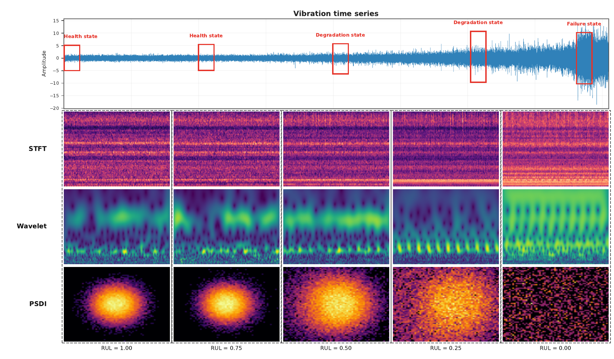
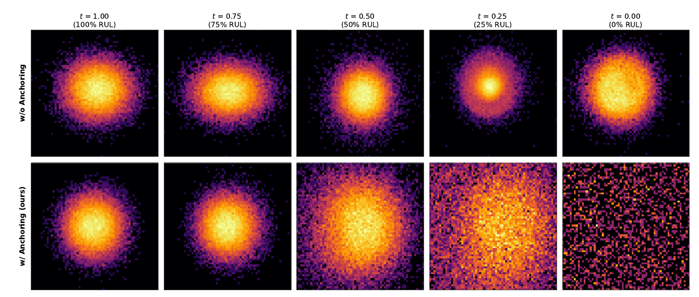
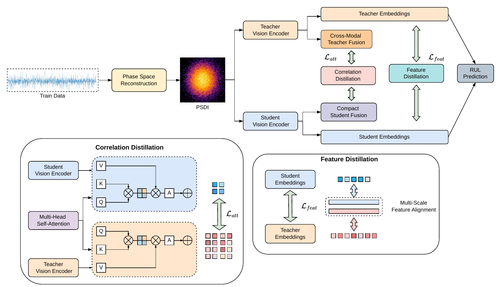

<div align="center">

# Geometry-Aware Visual Representation for Remaining Useful Life Prediction

**Trung Hieu Vu, Tien Thanh Nguyen, Eyad Elyan**

Robert Gordon University, Aberdeen, United Kingdom

**ECCV 2026**


</div>

<p align="center">
  
</p>

<p align="center"><em>
Figure 1. Signal representations from healthy to failure states.
Time-domain and time–frequency views change mostly in amplitude and energy.
PSDI shows a clear geometric dispersion in phase space as degradation progresses.
</em></p>

This repository is the official implementation of the paper
**"Geometry-Aware Visual Representation for Remaining Useful Life Prediction"** (ECCV 2026).

## Motivation

> When we convert a vibration signal into an image for RUL prediction, what must that image represent?

**Energy maps do not show dynamics.**
Remaining Useful Life (RUL) prediction is difficult because degradation is stochastic and the mechanical dynamics are nonlinear.
Most image-based methods convert vibration signals into time–frequency maps, such as STFT or wavelet images.
These maps show how spectral energy changes.
They do not directly show how the system dynamics evolve toward failure.
In Figure 1, the raw waveform grows in amplitude, but its local oscillation pattern stays similar across health states.

**PSDI is a density map, not an energy map.**
Time-delay embedding lifts the scalar signal into a phase space that approximates the system dynamics.
In this space, degradation is a structural transition.
The trajectory distribution changes from compact, to dispersed, and finally to fragmented.
PSDI captures this transition as an image.

**Reconstruction alone is not enough.**
Takens' theorem gives a dynamically equivalent reconstruction, but not a unique coordinate system.
If each sample estimates its own projection basis, the coordinate frame drifts.
This drift can look like real degradation.
GAR builds one fixed reference from healthy data and applies it to all later samples.
As a result, the model sees every degradation stage in the same healthy coordinate system.

**Degradation differs between bearings.**
The degradation pattern changes across operating conditions and also between bearings under the same condition.
Some bearings fragment early, and others stay concentrated until much later.
The shared healthy reference keeps the degradation progression readable across bearings.

## Overview

This work reformulates RUL prediction as learning from the geometric evolution of reconstructed system states.
The main contributions are:

- **Phase Space Density Image (PSDI).** A visual representation that encodes the spatial density of time-delay embedded trajectories. Degradation appears as a progressive dispersion of the system attractor.
- **Globally Anchored Reconstruction (GAR).** A shared healthy reference frame for phase-space reconstruction. GAR removes coordinate drift, so geometric changes in PSDI reflect true degradation.
- **Compact knowledge distillation framework.** A high-capacity pretrained teacher transfers visual priors to a compact student. Sliding-window temporal aggregation reduces prediction jitter.

## Method

### PSDI with Globally Anchored Reconstruction

Each vibration window is lifted into an *m*-dimensional phase space with time-delay embedding (Takens' theorem).
The delay τ comes from mutual information and the dimension *m* comes from Cao's method.
The global values (*m*\*, τ\*) are the medians over the healthy training sequences.

If each sample fits its own PCA basis, the coordinate system changes from sample to sample.
GAR fits one PCA basis and one set of histogram bounds on early-life (healthy) data only.
These anchors stay frozen for all training and test samples.
Each new window is projected onto this frozen basis, converted to a 2D density histogram, log-compressed, and normalized to [0, 1].

<p align="center">
  
</p>
<p align="center"><em>
Figure 2. PSDI evolution without anchoring (top) and with GAR (bottom).
Without anchoring, healthy and faulty states look similar. With GAR, degradation appears as a progressive spatial dispersion.
</em></p>

### Knowledge distillation framework

<p align="center">
  
</p>
<p align="center"><em>Figure 3. Overview of the knowledge distillation framework.</em></p>

- **Teacher.** A pretrained vision backbone (MAE, CLIP, or EfficientNet-B3) with a RUL regression head. The backbone is frozen by default.
- **Student.** A compact encoder (Tiny-ViT, EfficientNet-B0, or MobileNet-V3). Cross-attention injects the 1D PC1 trajectory into the PSDI patch tokens.
- **Temporal aggregation.** The student averages features over a window of *K* consecutive PSDI frames. This operation reduces the prediction variance by a factor of order 1/*K*.
- **Loss.** SmoothL1 RUL loss, feature distillation (MSE + cosine + KL), and correlation (attention) distillation. The loss weights and the distillation temperature are learnable.

## Installation

1. Clone the repository and go to the project root.
2. Install the dependencies:

```bash
pip install -r requirements.txt
```

The core packages are pinned at the top of `requirements.txt`.
The extended packages (`einops`, `timm`, `sktime`, and more) are only necessary for the time-series baselines.

## Data preparation

### 1. Download the raw datasets

| Dataset | Source | Bearings |
|:--|:--|:--|
| XJTU-SY | [Official repository](https://github.com/WangBiaoXJTU/xjtu-sy-bearing-datasets) ([Google Drive](https://drive.google.com/drive/folders/1_ycmG46PARiykt82ShfnFfyQsaXv3_VK)) | 15 bearings, 3 operating conditions |
| PHM 2012 (PRONOSTIA) | [GitHub mirror](https://github.com/wkzs111/phm-ieee-2012-data-challenge-dataset) | 17 run-to-failure bearings, 3 operating conditions |

### 2. Arrange the raw data

Put each dataset under `data/raw_data/`:

```text
data/raw_data/
├── XJTU-SY/                      # as distributed, one folder per condition
│   ├── 35Hz12kN/Bearing1_1 ... Bearing1_5/   1.csv, 2.csv, ...
│   ├── 37.5Hz11kN/Bearing2_1 ... Bearing2_5/
│   └── 40Hz10kN/Bearing3_1 ... Bearing3_5/
└── PHM-2012/                     # Learning_set + Full_Test_Set, merged flat
    ├── Bearing1_1 ... Bearing1_7/            acc_00001.csv, ...
    ├── Bearing2_1 ... Bearing2_7/
    └── Bearing3_1 ... Bearing3_3/
```

For PHM 2012, use `Full_Test_Set`, not `Test_set`.
`Test_set` contains truncated runs, but the RUL labels need the full run-to-failure data.
The number of CSV files per bearing must match the original datasets.
The FPT/EOL table in `utils/rul.py` depends on these file counts.

### 3. Build the PSDI datasets

```bash
# Case 1 (XJTU-SY)
python scripts/data_processor/build_dataset_case1.py --denoise off --image-bins 224

# Case 2 (PHM 2012, condition 1)
python scripts/data_processor/build_dataset_case2.py
```

Each builder writes `train.npz`, `val.npz`, `test.npz`, and `pca_metadata.pkl` to `data/processed_data/`:

```text
data/processed_data/
├── case1/denoise_off/image_bins_224/
└── case2/
```

`pca_metadata.pkl` stores the global anchors (*m*\*, τ\*, PCA basis, and histogram bounds).
The Case 1 builder reuses this file on the next run.

## Training and evaluation

Train Case 1 with one command:

```bash
bash scripts/rul/train_rul_xjtu_denoise_off.sh
```

### Experimental cases

This repository includes builders for two cases of the paper (Supplementary Table 2).

| Category | Case | Training bearings | Test bearing | Builder in this repository |
|:--|:--|:--|:--|:--|
| Same condition | 1 | XJTU 1-2, 1-3, 1-4, 1-5, 2-1, 2-2 | XJTU 1-1 | `build_dataset_case1.py` |
| Same condition | 2 | PHM 1-1, 1-2, 1-3, 1-4, 1-6, 1-7 | PHM 1-5 | `build_dataset_case2.py` |

In this repository, the builders hold out part of the training bearings as a validation split.

## Project structure

```text
├── run.py                        # Entry point (--task_name rul)
├── exp/exp_rul.py                # Three-phase training, validation, and test loop
├── src/psdi_kd/
│   ├── rul_model.py              # Teacher, student, and CNN baselines
│   └── distill.py                # Distillation losses, learnable weights, and temperature
├── utils/
│   ├── psr.py                    # Mutual information delay, Cao dimension, delay embedding, density image
│   ├── data_utils.py             # Global anchor estimation (GAR) and dataset building
│   └── rul.py                    # FPT/EOL tables and piecewise RUL
├── data_provider/                # Dataset loaders
├── scripts/
│   ├── data_processor/           # PSDI builders for Case 1 and Case 2
│   └── rul/                      # Training scripts
├── tools/                        # Visualization scripts
├── assets/                       # Figures for this README
└── data/                         # raw_data/ and processed_data/ (not tracked)
```

## Citation

If this work is useful for your research, please cite:

```bibtex
@inproceedings{vu2026psdi,
  title     = {Geometry-Aware Visual Representation for Remaining Useful Life Prediction},
  author    = {Vu, Trung Hieu and Nguyen, Tien Thanh and Elyan, Eyad},
  booktitle = {European Conference on Computer Vision (ECCV)},
  year      = {2026}
}
```

## Acknowledgements

The authors thank Innovate UK and ADC Energy Ltd. for financial support through the Knowledge Transfer Partnership (KTP) project No. 13518.

We thank the authors of the [XJTU-SY](https://github.com/WangBiaoXJTU/xjtu-sy-bearing-datasets) and PHM 2012 (PRONOSTIA) datasets.
